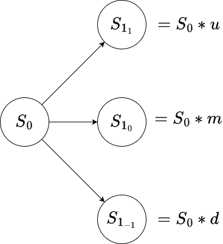
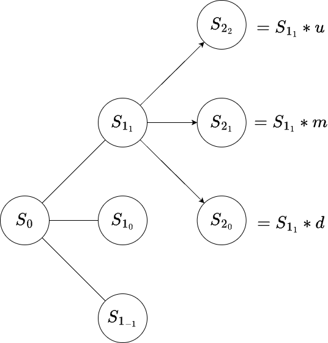
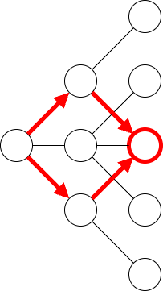
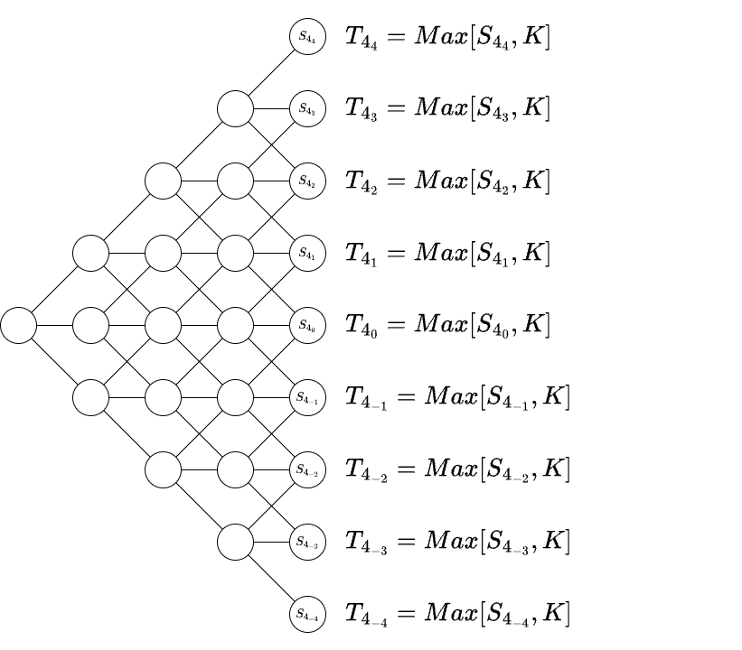
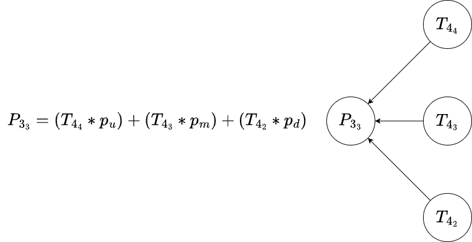

Innovation Options measure the return on investment (ROI) of pre-growth initiatives based on the option value they provide to the firm. They are an effective alternative to traditional, cash-flow based approaches such as Net Present Value which fail under conditions of high market uncertainty.

In this article, I’ll detail how to calculate the ROI of an Innovation Option using the trinomial option pricing model. First, I’ll describe the trinomial model’s general approach and equations. Second, I’ll demonstrate how the trinomial is adapted specifically for innovation. Third, I’ll show how you use the model to generate an ROI for the Innovation Option and measure progress during its term. Finally, I’ll describe some of the advantages and limitations of the Innovation Option approach and provide some tools for the model’s real-world application.

### The Trinomial Model

The [Trinomial](https://en.wikipedia.org/wiki/Trinomial_tree) is an option-pricing model developed by [Phelim Boyle](https://en.wikipedia.org/wiki/Phelim_Boyle) in 1986.  It is the most-common method to value American-style options (as opposed to the more widely-known [Black-Scholes Model](https://en.wikipedia.org/wiki/Black%E2%80%93Scholes_model) used primarily for European-style options).  The Trinomial Model has three steps.

#### Step One: Build Range of Future Values

Step one constructs a range of possible future values for an opportunity from a given starting point. Think of it like a storm tracker; from the current position of the storm, the potential path expands into a cone across the possible area of impact. The further in the future, the greater the size of the cone. That’s what happens in step one: from a known starting point, the range of values branches out over the life of the option. It could appreciate greatly and always be headed “up and to the right”. Or it could be a complete disaster, always losing value. Or it could go up, then down, then up, then flat -- anywhere in between the best and worst case.

This range is called a “lattice”, or a series of connected nodes that looks like a sideways branching tree. Mathematically the lattice is constructed by applying these equations to each node in sequence, starting with the initial value:

$$u=e^{\sigma\sqrt{2\Delta}t}$$

$$m=1$$

$$d=e^{-\sigma\sqrt{2\Delta}t}=\frac{1}{u}$$

The components of these equations are the constant $e$, the duration of the time step $\Delta{t}$, and the volatility of the proposed investment $\sigma$. (We’ll show later how to calculate these and other variables; for now simply assume them to be known.) The desired outputs are the factors $u$, $d$ and $m$, by which the investment may increase, decrease, or remain the same, respectively.  It is from these three moves that the Trinomial is named.

With the factors determined, you build the lattice by taking your starting point $S_0$ (called the Spot) and multiplying it by the $u$, $d$ and $m$ factors.

Then, those three results are themselves multiplied by $u$, $d$ and $m$, creating still more nodes.

This continues for a given number of steps until the option’s term (the period within which it must be exercised) expires.

An interesting feature to note is that the $u$ and $d$ factors are reciprocals of one another. This means that going up in one step and then down in the next results in the same value as if you went down and then up.

In fact, any combination of up/down/flat moves results in the same possible future value. This is called a recombining matrix, making the trinomial method fairly easy to visualize and calculate.

On completion of Step One you have a lattice of arbitrary size, comprised of each potential combination expected values, from a single time zero value into n values at the option expiry.

#### Step Two: Calculate Terminal Values

Step Two is about factoring the choice the option represents into its value at expiration.  There is no requirement that you exercise an option; it’s a right to purchase, not an obligation.  Accordingly, if the option is a net positive we use that value; if it’s a net negative we walk away and the value is zero. Step Two simply keeps the positive values and zeros the rest.

Calculating the exercise value is fairly simple: just subtract the proposed investment (called the Strike, or $K$) from that possible future value (the future Spot, called $S_n$) and take the difference or $0$, whichever is greater. For instance, if the future value is $2 and the investment is $5 we’d lose $3 if we did that deal, but since we are under no obligation to buy we simply walk away. If instead the future value were $12 we’d make $7, and take that deal. Mathematically, we write this as:

$$Max[S_n-K, 0]$$

Simply apply that to every possible expected value at expiry, and you have the total range of terminal values at option expiry.

#### Step Three: Calculate the Discounted Expected Values

Finally, we work from those potential future terminal values back to the present. We are sequentially saying, “OK, if this is a future outcome, what does it look like right before that outcome?”  We determine that by summing the discounted expected value equations for the three child nodes into their parent node.

So, starting with the penultimate nodes, calculate these using the factors:

$$p_u = \left(\frac{e^{(r - q)  \Delta t / 2}- e^{-\sigma\sqrt {\Delta t/2}}}{e^{\sigma\sqrt {\Delta t/2}}- e^{-\sigma\sqrt {\Delta t/2}}}\right)^2 \,$$

$$p_m = 1 - (p_u + p_d) \,$$

$$p_d = \left(\frac{e^{\sigma\sqrt {\Delta t/2}}-e^{(r - q)  \Delta t / 2}}{e^{\sigma\sqrt {\Delta t/2}}- e^{-\sigma\sqrt {\Delta t/2}}}\right)^2 \,$$

The equations here are the most complex, but in plain English they say, “multiply the terminal values by their expected value, and sum those results taking into account the time value of money at the risk-free rate $r$ less any possible dividend-yield $q$.”

Continue calculating backward column by column, node by node, through the entire lattice.  Repeating this process back to time zero results in a single number that represents the value of the option today.

Thus, in contrast to a traditional project where value is determined from a single estimated future outcome, an option considers many different future outcomes, calculates their relative probability, and sums together their discounted expected values to get the current value.

### Trinomial Variables

Now that we have a general understanding of how the Trinomial Model is constructed, we can turn to how each variable is determined.

*   The constant $e$.
*   The risk-free rate ($r$), or the rate of return on an investment considered to have zero-risk.
*   The dividend-yield rate ($q$), or the expected dividends during the option period divided by the spot price of the underlying investment.
*   The strike $K$, which is the agreed-upon future price at which the option would be exercised.
*   The spot $S$, which is the market price of the underlying instrument at any given time, and is used as the value of the initial node $S_0$ at time zero.
*   The time period $\Delta{t}$, which is the annualized period of time until expiry divided by the number of iterations.  In our example above, the number of iterations is four ($S_0$ -\> $S_4)$, and if we assume the duration to be one year then the $\Delta{t}$ is one fourth of one, or .25.
*   The sigma ($\sigma$) is the standard deviation of the log-returns for historical prices of the underlying instrument, and is a measure of overall volatility.  It is calculated through the following equation, for time periods $T$ and spot price $X$.

$${\sigma} = \sqrt{\frac{1}{T}\sum_{t=1}^T \left(\ln(X_{t}) - \ln(X_{t-1})\right)^2}$$

*   Finally, we have the dependent variable $P_0$, which is the output of the trinomial model and represents the price of the option, or its Premium.

### Applied to Innovation

Conceptually, Innovation Options are similar to their traditional counterparts: they represent the right, but not the obligation, to make a future purchase at a fixed price, thus delaying the investment decision until more is known about the market. In the innovation context, the investment decision is "should we enter the market for this new product?" and the option is designed to value the resources allocated to determine the answer to that question.  Therefore, to apply the Trinomial Model to innovation we must outline the analogues to each of the variables that go into it.

Some of these are fairly straightforward: the constant $e$ is always $e$, as is the risk-free rate $r$.  Additionally, absent truly extraordinary circumstances, the innovation project will not return any dividends and so the dividend-yield $q$ will be zero.

Next we address the Strike $K$.  This is the agreed-upon price for the future investment, which in an innovation context represents the investment required to bring the product to market at scale.  This can be thought of as a "Series A" investment, or the budgetary request of a more typical NPV-backed proposal.  This varies from project to project dependent on the industry, but as a rough guideline typically ranges in the single-digit to hundreds of millions of dollars.  Whatever the number, it represents the amount of money the project will receive if the option is exercised.

Next, we need to determine a Spot value $S_0$. Normally we’d use the stock quote for the underlying instrument as the spot, but obviously there is no such quote available for innovation projects. However, we do know that if the option were exercised it would receive the Strike as cash.  Further, if we then immediately returned that cash upon exercise, the ultimate return would be zero since there will be no other opportunities to create any additional value. Thus, for our option we are able to approximate the Spot by making it equivalent to the Strike, or $S_0 = K$.

Next, we must determine $\Delta{t}$, which itself is comprised of the total time $T$ and number of iterations $i$.  To determine $T$, simply gauge the duration of the research period and set it to that period in years.  The number of iterations $i$ can be arbitrary, but in an innovation context should correspond roughly to the number of trials expected during the research period $T$.  This makes the time period the duration divided by the iterations, or $\Delta{t}={i}/{T}$.  For example, a one year option that expected to release trial products quarterly would have a $T$ of $1$ and an $i$ of $4$, resulting in a $\Delta{t}$ of $.25$.

Finally, we consider the $\sigma$.  As with the Spot, we'd normally use stock quotes over time to determine the volatility of the underlying instrument; no such quotes are available for our innovation projects.  However, we do have an analogue in the form of post-money valuations for ventures in similar industries.  For example, if we were to aggregate the various Series A investments in Artificial Intelligence we would arrive at an implied volatility that can serve as a reasonable approximation for the actual $\sigma$ for an innovation project focused on AI.  Given that Series A investments have natural bounds both in terms of amount and valuation that tend to cluster to a central mean, the resulting $\sigma$ tends to reflect their corresponding industries with remarkable precision.  Whether or not this is mathematical proof of the fabled "herd mentality" of venture capitalists I leave for others to decide...

I've calculated the $\sigma$ for various investment areas that you can use in  your own innovation options, which I keep updated and you can find here.  Alternatively, firms with a history of investing in innovation projects can use their own internal valuation benchmarks for greater relevance and precision. Simply find previously funded projects similar in scope and concept to the idea being considered, and use their original business plan valuations to create the boundary range. Note that you should consider all projects that were approved and funded -- not solely the ones that were successful -- to provide the complete picture of the value these ideas command within the firm.

At this point we simply need to plug these variables into the equations and run the three steps outlined above.  This results in the dependent variable $P_0$, which represents the value of the option at time zero, or the Premium.  This is the amount that the answer to the question "should we pursue this idea?" is worth to the firm today.

As mentioned before, the duration $T$ and iterations $i$ are fundamentally arbitrary, and can be set to whatever values you wish.  That said, when considered in an innovation context they do take on special significance that should factor into your consideration when considering the Premium.

To explain, the standard Trinomial Model is effectively a simulation (similar to a Monte Carlo analysis).  In contrast, during our experimentation period we are going to run actual trials in the real world. In fact, that is the entire point of the option: we are delaying the more substantial investment decision ($K$) until we know more about the market.  Thus, with an Innovation Option each node no longer represents the *possibility* of “it could go up, it could go down, it could stay the same” -- instead, it reflects the *actual* value of “it _did_ go up, it _did_ go down, it _did_ stay the same”.  We are using the market information gleaned during the experimentation period to give us some sense of which path the investment will take through the lattice.  In this way, the number of iterations $i$ should represent the number of market trials you expect to conduct during the term of the option.

Moreover, the resources required to fund this period of experimentation are set, which means that they will only last for a set period of time.  In other words, the expiration for the option $T$ is equivalent to the duration of the funds allocated for that purpose divided by the burn rate.

This implies that firms can use an abstract Premium $P_0$ to determine if they are appropriately pricing their early-stage innovation investments.  So, for instance, if the Premium of a given idea is calculated as $250K, but the firm is requesting $2M, this request can be denied on the basis of negative ROI.  Similarly, the firm can invest more heavily in projects whose budget requests represent more attractive returns.  However, the best course of action would be to arbitrage all projects so that the firm can apply the scarce resources of the firm for maximum efficiency.

#### Advantages

Innovation Options have significant advantages over traditional cash-flow analyses such as Net Present Value (NPV). Most centrally, an options-based approach embraces the uncertainty associated with innovation. Considering a range of possibilities -- including complete failure -- is at the heart of the model. In contrast, an NPV-based analysis only considers a single outcome based on far-future forecasts that are highly suspect in uncertain markets.

In addition, options are dynamic, adjusting to new information as it becomes available. An NPV analysis is static; once the initial forecast is made it can’t be changed without calling into question the entire financial justification for the project. This also produces a moral hazard: any information that runs counter to the original assumptions tends to be discounted, minimized, or outright ignored in favor of the approved plan. Options encourage transparency because the plan is to gather information, both good and bad.

Also, options tend to be much faster to implement than other governance approaches. With an NPV profitability has to be included from the outset; projects with negative returns never get approved. This leads to concepts like robustness and economies of scale that are misplaced priorities at the earliest innovation stages. Options encourage smaller steps, which reduce the overall variance (ie, the riskiness) of the project.

In short, options expect you to *determine* revenue, while NPV expects you to *deliver* revenue. For well-known products in established markets it is reasonable to use NPV because we can somewhat-reliably predict the future. For unknown products in unknown markets with discontinuous innovation, NPV fails completely -- and often catastrophically.

#### Limitations

Despite these advantages, it does not mean the Options model is perfect.  To start, it is substantially more complex than linear approaches. Terms such as $\sigma$ and $e$ are unfamiliar and somewhat counter-intuitive, while NPV’s method of subtracting current costs against future profits is much simpler to conceptualize and implement.

Also, while not strictly speaking a limitation, it’s worth noting here that some of the underlying variables such as the Sigma are lossier in opaque markets than they are in open markets, and so the resulting Premium is far from perfect.  That said, this valuation will always be superior to an NPV valuation which, for markets without any history, is at best a fabrication (if not an outright deception.)

In general, the way to address these limitations is to be as honest as possible in inputs and assessments. Again, while NPV-style investments discourage any information that runs counter to the initial forecast, options encourage the reality whatever it may be. If an NPV investment doesn’t provide a return, it fails. In contrast, an option only fails if it reaches the wrong conclusion. Thus, the former encourages confirmation bias while the latter encourages truth, for good or ill.

### Summary

Options are necessarily more complex than traditional investments. While the former must consider a range of possibility the latter only has one reality to manage. Still, when facing uncertain markets the option approach is the superior choice. It changes our valuation process from divination to discovery. If we decide to exercise the option and pursue the opportunity, then we can have confidence that evidence and not supposition drove that decision. And, if the eventual conclusion is that the option should not be exercised it has still served its purpose; we can put scarce resources to better, more productive use. Either way, we do not have to make our most critical decision at the precise moment we have the least amount of information. Instead, we can value our discovery efforts by demonstrating the Return on Investment from the perspective of the optionality those efforts represent.
